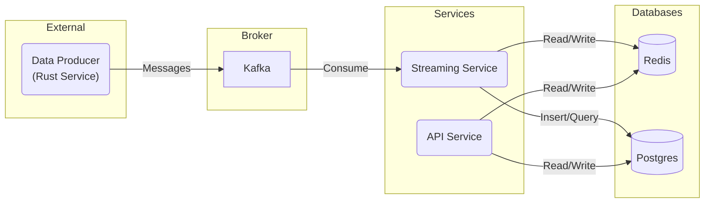

# Rusty Stream - Microservices Platform

A Rust-based microservices platform demonstrating real-time data processing with Kafka, Postgres, Redis, and Docker.

## Architecture Overview



## Features

- Real-time data ingestion using Kafka
- Data persistence with Postgres
- Caching with Redis
- REST API endpoints for data access
- Containerized with Docker
- Async Rust implementation

## Prerequisites

- Docker & Docker Compose
- Rust (optional for local development)
- `curl` or Postman for API testing

## Project Structure

```
.
├── api_service
├── data_producer
├── streaming_service
├── docker-compose.yml
└── README.md
```

## Getting Started

1. **Clone the repository**

   ```bash
   git clone https://github.com/yourusername/rusty-stream.git
   cd rusty-stream
   ```

2. **Start the services**

   ```bash
   docker-compose up --build
   ```

   This will start:

   - Zookeeper & Kafka
   - Postgres database
   - Redis
   - Data Producer (sends mock sensor data to Kafka)
   - Streaming Service (processes Kafka messages)
   - API Service (REST endpoints)

3. **Verify services are running**

   Check container status:

   ```bash
   docker-compose ps
   ```

## API Endpoints

- **Get latest sensor data**

  ```bash
  curl http://localhost:3000/data
  ```

- **Get cached value for a sensor**

  ```bash
  curl http://localhost:3000/recent/sensor-123
  ```

- **Post new sensor data (example)**

  ```bash
  curl -X POST -H "Content-Type: application/json" -d '{
      "sensor_id": "sensor-456",
      "value": 42.5,
      "timestamp": 1689260000
  }' http://localhost:3000/data
  ```

## Key Components

### Data Producer

- Generates mock sensor data every 2 seconds
- Publishes to Kafka topic `sensor-data`
- Uses `rdkafka` for Kafka integration

### Streaming Service

- Consumes messages from Kafka
- Stores raw data in Postgres
- Caches latest value in Redis
- Uses `tokio-postgres` and `redis-rs` crates

### API Service

- Exposes REST endpoints using Axum
- Retrieves data from Postgres and Redis
- Supports write operations to Postgres

## Database Setup

Postgres schema is automatically created by the streaming service:

```sql
CREATE TABLE IF NOT EXISTS sensor_data (
    id SERIAL PRIMARY KEY,
    sensor_id TEXT NOT NULL,
    value DOUBLE PRECISION,
    ts BIGINT
);
```

## Environment Variables

Service configurations are hardcoded for simplicity. For production use, consider adding:

- `.env` files for environment variables
- Proper security configurations
- Connection pooling settings

## Stopping Services

```bash
docker-compose down -v
```
